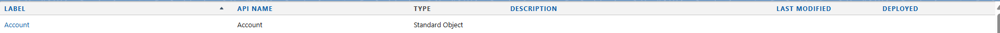
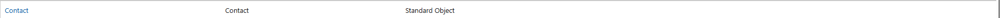
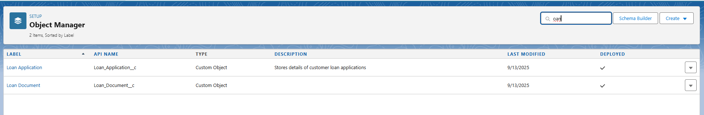
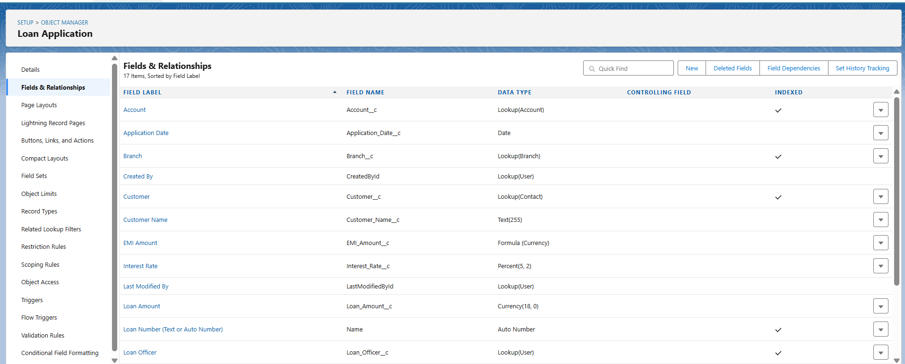
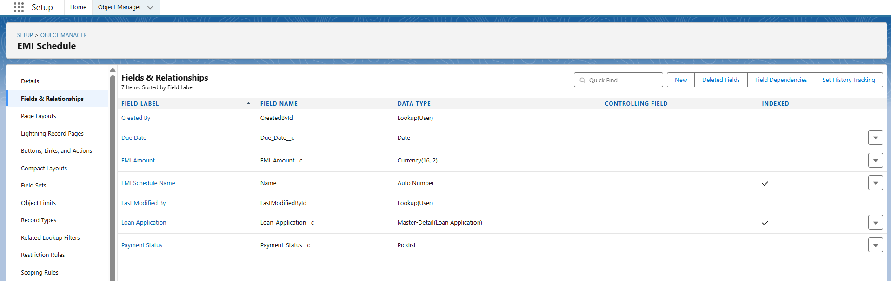
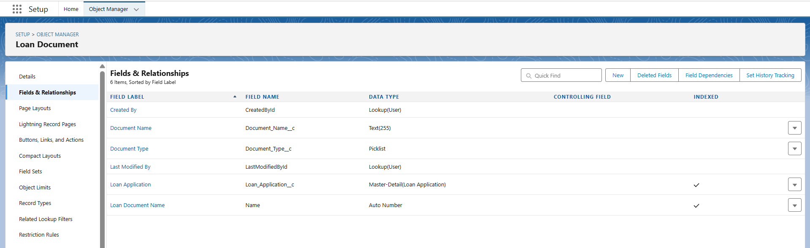
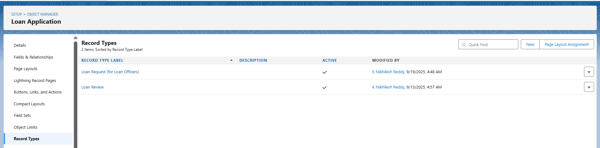
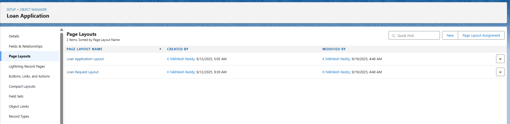
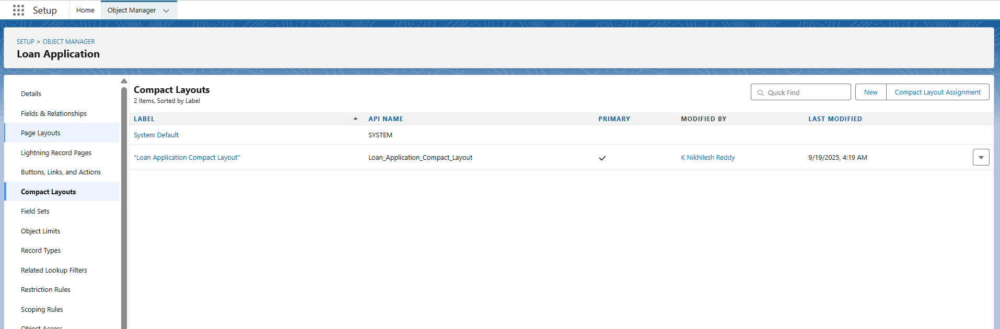
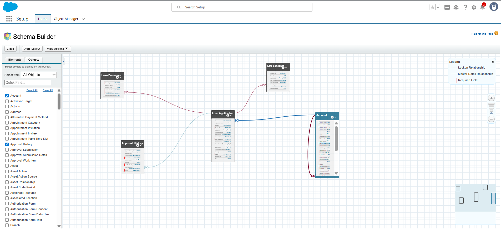

# Phase 3: Data Modeling & Relationships – CLMS Project

## 1. Standard & Custom Objects

### Standard Objects
- **Account** → Represents Borrowers (individual or corporate).
- **Contact** → Stores borrower contact details.
  
  

### Custom Objects
- **Loan Application** → Loan request details (Loan Type, Amount, Tenure, Interest Rate, Status).
- **EMI Schedule** → Repayment installments (EMI Amount, Due Date, Status).
- **Loan Documents** → Loan-related documents (Proof of ID, Proof of Income, Collateral).
- **Approval History** → Loan approval/rejection trail (by Credit Manager and Finance Officer).

---

## 2. Fields

### Loan Application Fields
- Loan Number (Auto Number)
- Loan Type
- Loan Amount
- Loan Tenure (Months)
- Interest Rate
- EMI Amount
- Status (Pending, Approved, Rejected)
- Application Date
- Branch
- Loan Officer
- Customer (Account Lookup)
- Customer Name
  
### EMI Schedule Fields
- EMI Amount
- Due Date
- Payment Status
  

### Loan Documents Fields
- Loan Document Name
- Document Type
- Document Name
- Loan Application (Lookup)
- Created By
  

### Approval History Fields
- Approver Role (Picklist: Credit Manager, Finance Officer)
- Decision (Picklist: Approved, Rejected, Pending)
- Date of Action (Date/Time)
- Comments (Text)
- Loan Application (Lookup)
  

---

## 3. Record Types
- **Personal Loan**
- **Business Loan**
- **Home Loan**
  

Each record type has its own page layout and picklist values.

---

## 4. Page Layouts
- **Loan Application Layout** → Loan details + related lists (EMI, Documents, Approval History).
- **EMI Schedule Layout** → EMI Amount, Due Date, Status.
- **Loan Documents Layout** → Document Type, Document Name, Loan Application.
- **Approval History Layout** → Approver Role, Decision, Date of Action, Comments.
   
    
 

---

## 5. Compact Layouts
- **Loan Application Compact Layout** → Loan Number, Customer Name, Loan Amount, Loan Type, Status, Application Date.
- **EMI Schedule Compact Layout** → EMI Amount, Due Date, Status.
- **Loan Documents Compact Layout** → Loan Document Name, Document Type, Loan Application, Created By.
- **Approval History Compact Layout** → Approver Role, Decision, Date of Action, Loan Application.
 
---

## 6. Schema Builder
- Visual data model showing object relationships.
- Final schema:
  - Account → Loan Application (Lookup)
  - Loan Application → EMI Schedule (Master-Detail)
  - Loan Application → Loan Documents (Master-Detail)
  - Loan Application → Approval History (Lookup)
     

---

## 7. Lookup vs Master-Detail vs Hierarchical

- **Lookup Relationship** → Loose connection  
  *Example: Loan Application → Approval History*  
- **Master-Detail Relationship** → Strong parent-child  
  *Example: Loan Application → EMI Schedule, Loan Application → Loan Documents*  
- **Hierarchical Relationship** → Only for User object (Role Hierarchy)  
  *CEO → Branch Manager → Credit Manager → Loan Officer → Finance Officer*

---

## 8. Junction Objects 
- **Guarantor Mapping** → Junction object for many-to-many:
  - Borrower (Account) ↔ Loan Application.

---

## 9. External Objects 
- **Credit Bureau Records** (external object via Salesforce Connect).
- Used to fetch credit scores or external financial history for loan evaluation.

---

## 📌 Final Data Model
Account (Borrower)
   │
   └── Loan Application
        │── EMI Schedule (Master-Detail)
        │── Loan Documents (Master-Detail)
        └── Approval History (Lookup)

