#  Phase 4: Process Automation (Admin)

In this phase, various Salesforce automation tools were configured and implemented in the **Corporate Loan Management System (CLMS)**.  
The purpose of these automations is to ensure smooth processing of loan applications, enforce business rules, reduce manual effort, and provide real-time updates to different stakeholders involved in the loan lifecycle.

The tools used include:  
- Validation Rules  
- Workflow Rules  
- Process Builder  
- Approval Process  
- Flow Builder (evaluated)  
- Email Alerts  
- Field Updates  
- Tasks  
- Custom Notifications  

---

## 🔹 Validation Rules

Validation Rules were created on the Loan Application object to ensure data accuracy and enforce corporate policies. These rules prevent users from saving invalid data.

- **Loan Amount Validation** → Loan Amount must be greater than zero.  
- **Loan Tenure Validation** → Tenure must be at least 6 months.  
- **Interest Rate Validation** → Interest rate must be between 5% and 30%.  
- **Application Date Validation** → Application date cannot be in the future.  

 **Outcome:** Invalid or inconsistent data cannot be saved, which maintains high data integrity.  

 **Screenshot:**  
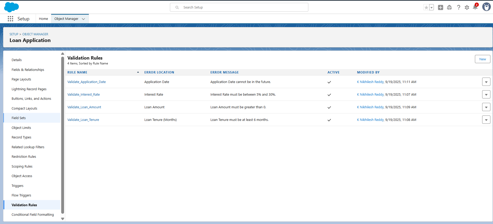  
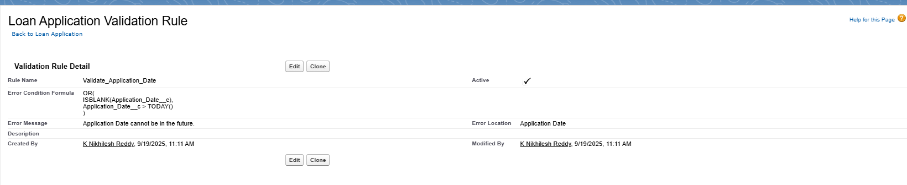 
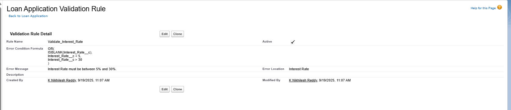 
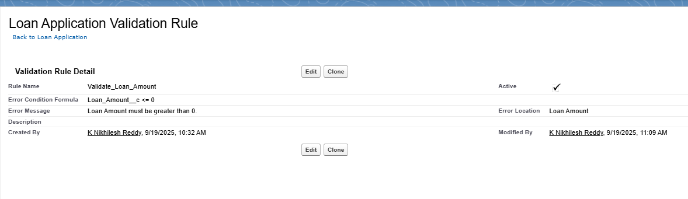 
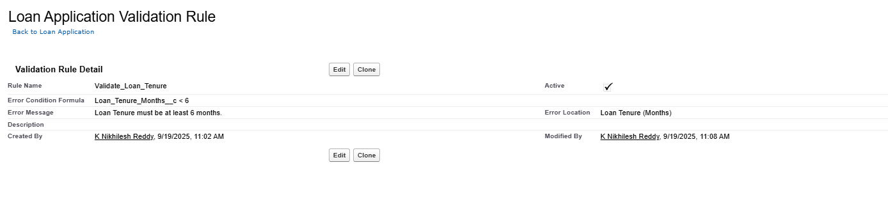 

---

## 🔹 Workflow Rules

Workflow Rules were implemented to automate routine actions triggered on Loan Applications.

- **Workflow 1: Email on Loan Approval**  
  - Trigger: Status = Approved by Branch Manager  
  - Action: Sends automated Loan Approval Email to Loan Officer  

- **Workflow 2: Approval Date Auto-update**  
  - Trigger: Status = Approved by Branch Manager  
  - Action: Updates `Approval_Date__c` with TODAY()  

- **Workflow 3: Task Assignment to Finance Officer**  
  - Trigger: Status = Approved by Branch Manager  
  - Action: Creates a Task “Disburse Loan Amount” for Finance Officer (due next day)  

 **Outcome:** Loan Officers are notified, approval timelines are recorded, and Finance Officers are reminded to disburse funds.  

 **Screenshot:**  
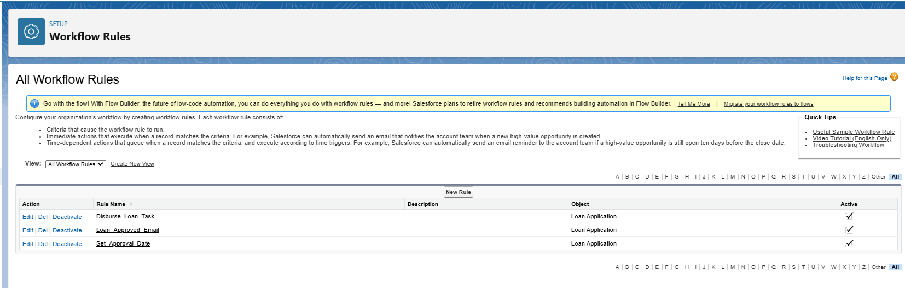  
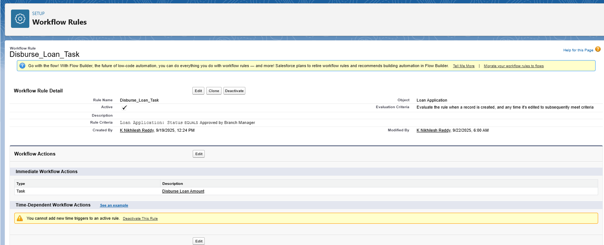
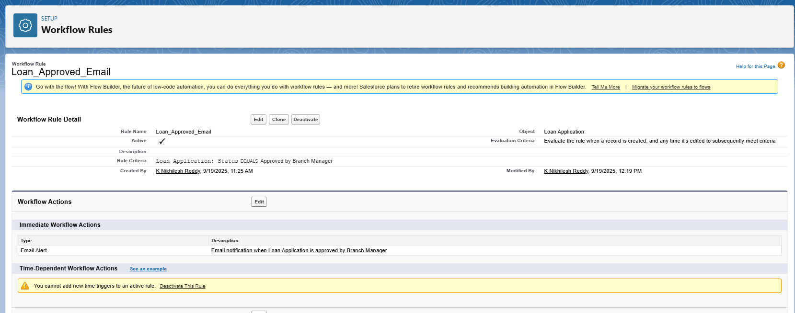
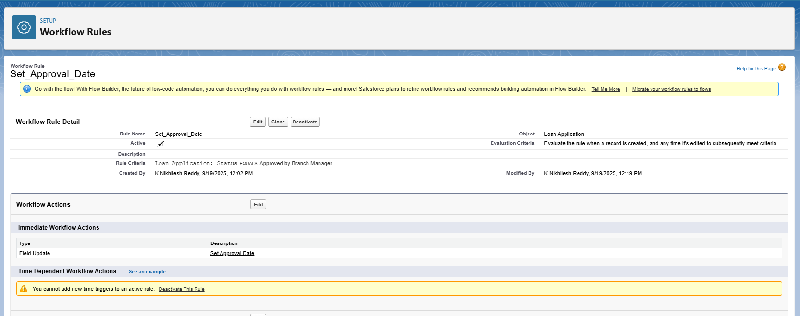

---

## 🔹 Process Builder

Process Builder was used for advanced automation that required creating related records.

- **Process: Loan Approval Process**  
  - Object: Loan Application  
  - Trigger: Status = Approved by Branch Manager  
  - Action: Create EMI Schedule record with:  
    - Loan Application linked to approved Loan  
    - EMI Amount = Loan Amount ÷ Loan Tenure  
    - Due Date = Today + 30 days  
    - Status = Pending  

 **Outcome:** EMI Schedules are generated automatically upon loan approval.  

 **Screenshot:**  
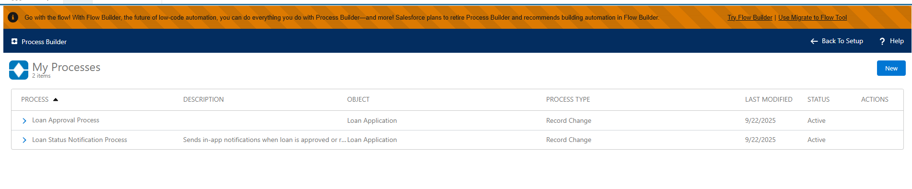  
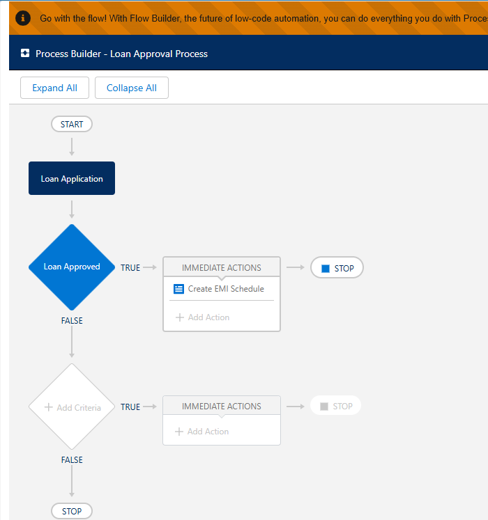


---

## 🔹 Approval Process

Approval Process was created to define hierarchical loan approval.

- **Step 1: Credit Manager Review** → Status = Pending → Approver = Credit Manager.  
- **Step 2: Branch Manager Review** → Status = Approved by Credit Manager → Approver = Branch Manager.  

- **Final Approval Action:** Status updated to Approved by Branch Manager → triggers Workflow Rules + EMI creation.  
- **Final Rejection Action:** Status updated to Rejected → Loan Officer notified (optional rejection email).  

 **Outcome:** Loans follow a structured, hierarchical approval chain (Loan Officer → Credit Manager → Branch Manager).  

 **Screenshot:**  
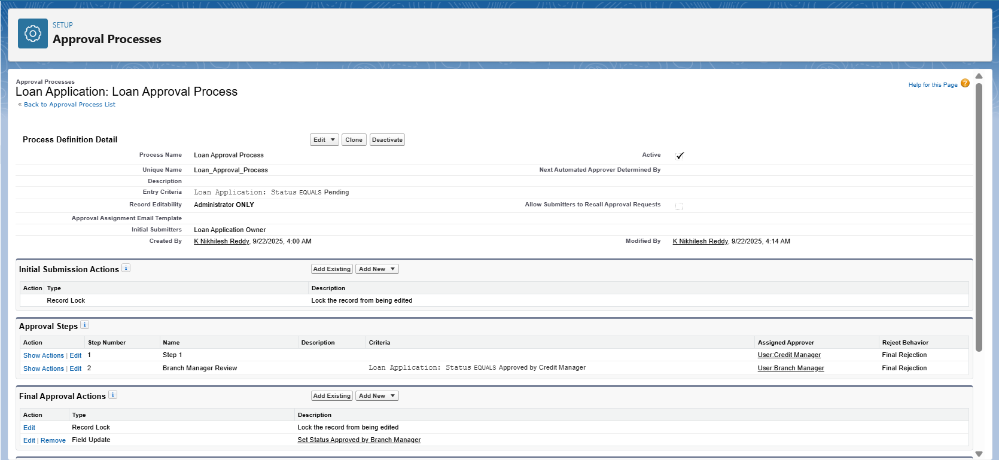  
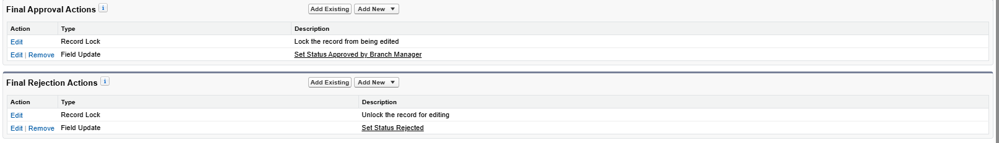 

---

## 🔹 Flow Builder (Screen, Record-Triggered, Scheduled, Auto-launched)

Flow Builder was evaluated but not used in this project to avoid redundancy.  
- Workflow Rules and Process Builder were sufficient for the required automations.  
- Flow Builder can be used in future enhancements (guided screens, scheduled updates).  

 **Outcome:** The automation design remains simple but scalable.  

 

---

## 🔹 Email Alerts

Email Alerts notify stakeholders of important loan lifecycle events.

- Loan Approval Email → Sent to Loan Officer  
 

 **Outcome:** Ensures transparency and timely communication.  

 **Screenshot:**  
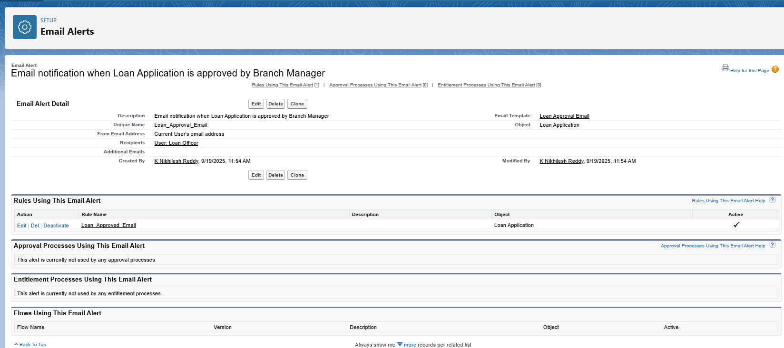  
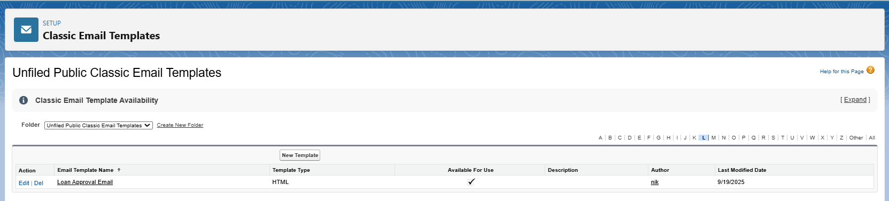 
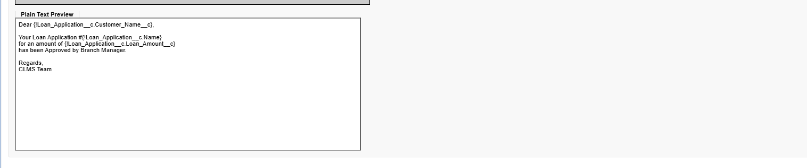 

---

## 🔹 Field Updates

Field Updates were configured to ensure data accuracy.

- `Approval_Date__c` auto-updated with TODAY() when loan is approved.  

 **Outcome:** Approval timelines are tracked automatically.  

 **Screenshot:**  
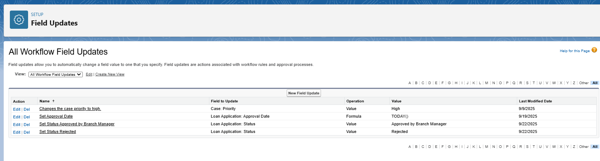  

---

## 🔹 Tasks

Tasks were created to assign responsibilities automatically.

- **Finance Officer Task:** When loan is approved, task “Disburse Loan Amount” is created for Finance Officer with due date = next day.  

 **Outcome:** Ensures disbursal activities are completed on time.  

 **Screenshot:**  
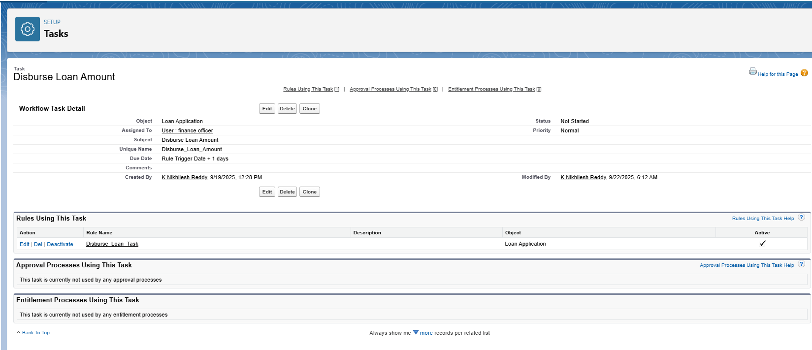  

---

## 🔹 Custom Notifications

Custom Notifications provide **real-time in-app alerts** to Loan Officers.  

- **Process: Loan Status Notification Process**  
  - Trigger: Status = Approved by Branch Manager OR Rejected  
  - Recipient: Loan Application Owner (Loan Officer)  
  - Title: Loan Status Update  
  - Message:  
    ```
    Loan Application [Loan_Application__c].Name has been [Loan_Application__c].Status__c.
    ```  

 **Outcome:** Loan Officers receive instant approval/rejection notifications in Salesforce Lightning and Mobile.  

 **Screenshot:**  
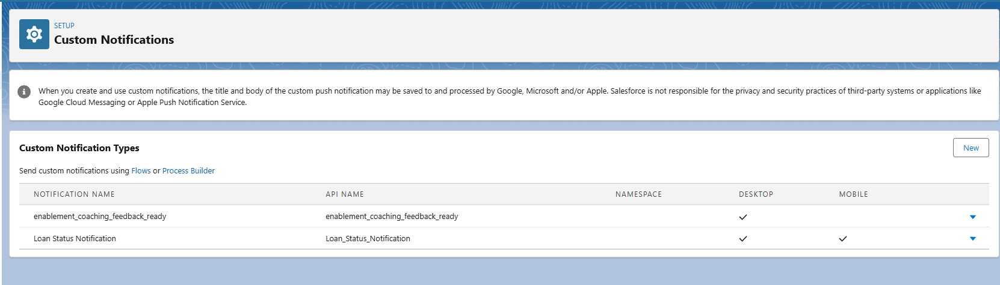  
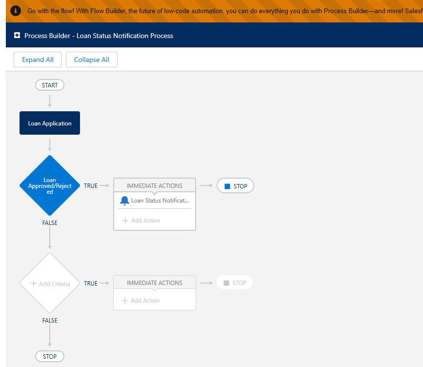

---

## 🔹 End-to-End Automation Flow

1. Loan Officer submits Loan Application (Status = Pending).  
2. Credit Manager approves → Status = Approved by Credit Manager.  
3. Branch Manager approves → Status = Approved by Branch Manager.  
4. Automations triggered:  
   - Loan Officer notified via email  
   - Approval Date auto-stamped  
   - Task assigned to Finance Officer  
   - EMI Schedule automatically created  
   - Loan Officer receives custom notification  
5. If rejected → Status = Rejected → Loan Officer notified.  
