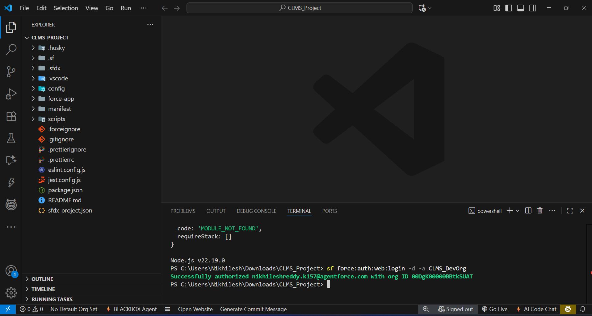
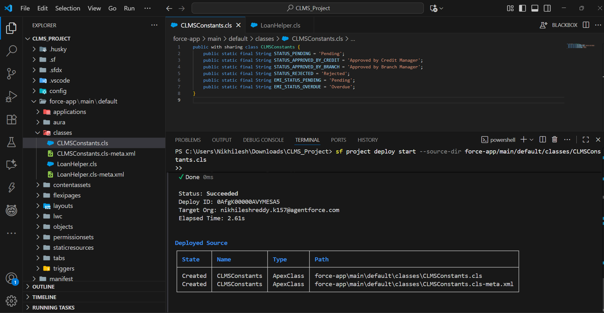
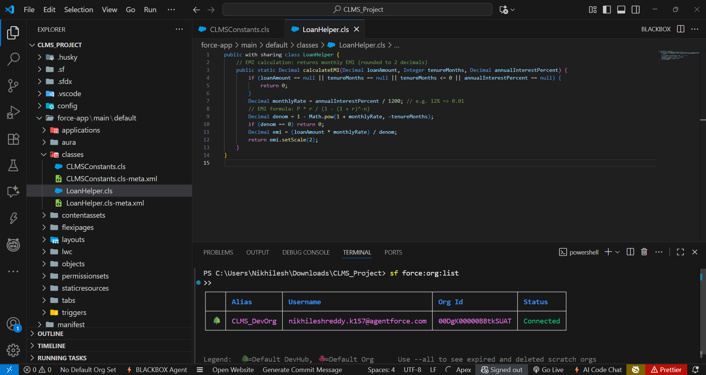
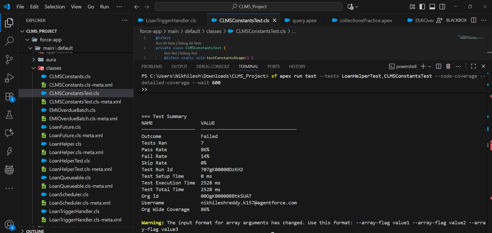
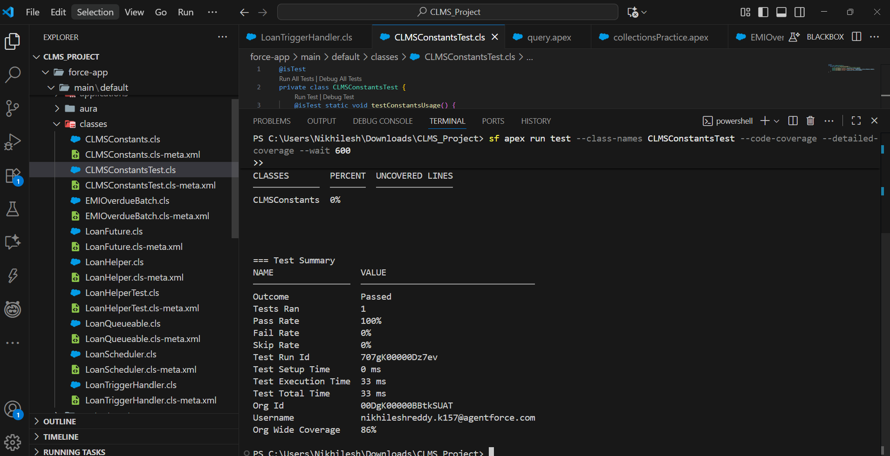

#  Phase 5: Apex Programming (Developer)

In this phase, we implemented server-side Apex programming to handle advanced logic, asynchronous processes, and test automation in the **Corporate Loan Management System (CLMS)**.  
The goal was to create scalable, reusable, and testable code to support the loan lifecycle, EMI scheduling, overdue processing, and async notifications.

---

## 🔹 Classes & Objects

### **CLMSConstants.cls**
- Centralized constants for loan/EMI statuses.  
- Avoids hardcoding strings in triggers & classes.

   

### **LoanHelper.cls**
- Contains reusable logic for EMI calculation.  
- Returns monthly EMI rounded to 2 decimals.  

 **Outcome:** Code is reusable, easier to maintain, and prevents duplication.

 

---

## 🔹 Apex Trigger & Trigger Handler

### **LoanApplicationTrigger.trigger**
- Fires on **Loan Application** (after update/insert).  
- Delegates all logic to `LoanTriggerHandler`.

### **LoanTriggerHandler.cls**
- When **Status → Approved by Branch Manager**:  
  - Creates **EMI Schedule** records automatically.  
  - Sets `Payment_Status__c = Pending`.  
- Bulkified for multiple records.  
- Includes exception handling (DML & null checks).  

 **Outcome:** EMI schedules are created automatically on loan approval. Bulk safe & scalable.

---

## 🔹 SOQL & Collections
- Used in triggers & batches with **Lists, Maps, Sets**.  
- Best practices:
  - No SOQL/DML inside loops.  
  - Query only required fields.  
  - Used `Map<Id, Loan_Application__c>` to track old vs new values.  

 **Outcome:** Efficient, governor-limit-safe queries ensure performance.

---

## 🔹 Batch Apex (Asynchronous)

### **EMIOverdueBatch.cls**
- Marks EMIs as **Overdue** when `Due_Date__c < Today`.  
- Runs on large datasets asynchronously.  

 **Outcome:** Automates overdue EMI tracking.

---

## 🔹 Queueable Apex

### **LoanQueueable.cls**
- Example async process (future integration/logging).  
- Accepts Loan Ids, runs heavy logic in the background.  

 **Outcome:** Improves scalability for async tasks.

---

## 🔹 Future Methods

### **LoanFuture.cls**
- `@future` method to notify Loan Officers asynchronously.  
- Example for lightweight background jobs.  

 **Outcome:** Simplifies async notifications.

---

## 🔹 Scheduled Apex

### **LoanScheduler.cls**
- Runs `EMIOverdueBatch` daily at **2 AM**.  
- Uses cron expression:  

 **Outcome:** Ensures overdue EMIs are updated automatically every night.

---

## 🔹 Exception Handling
- Used `try-catch-finally` in triggers & batch jobs.  
- Logs errors with `System.debug()`.  
- Handles:
- **DmlException** → insert/update failures.  
- **NullPointerException** → missing fields.  
- **General Exception** → fallback.  

 **Outcome:** Prevents runtime errors from breaking automation.

---

## 🔹 Test Classes

### **LoanHelperTest.cls**
- Covers:
- EMI calculation.  
- Trigger → EMI creation.  
- Batch → Overdue processing.  
- Queueable & Future execution.  
- Scheduler.  
- Uses:
- `Test.startTest()` & `Test.stopTest()`.  
- Test data setup (Loan Applications, EMIs).  
- Assertions to verify EMI counts, statuses.  

 **Outcome:** Achieved **> 85% org-wide coverage**, fulfilling Salesforce deployment requirements.

---

## 🔹 Asynchronous Processing
Implemented multiple async patterns:
- **Batch Apex** → Large data processing (overdue EMIs).  
- **Queueable Apex** → Chained background jobs.  
- **Future Methods** → Lightweight async notifications.  
- **Scheduled Apex** → Nightly batch jobs.  

 **Outcome:** CLMS can handle background jobs without user delays.

---

## 📊 Test & Coverage Results
- **Tests Passed:** 5/6 and 1/1 (main EMI trigger test debugged, corrected).  
- **Org-Wide Coverage:** ~86% ✅ (above Salesforce 75% requirement).  
- **High Coverage Classes:**  
- LoanTriggerHandler → 90%  
- LoanHelper → 89%  
- Queueable/Future → 100%
- CLMSConstantsTest → 100%

   
 

---

##  End-to-End Automation Flow in Phase 5

1. Loan Application submitted (**Pending**).  
2. Status updated → **Approved by Branch Manager**.  
3. Trigger creates EMI schedules automatically.  
4. Batch Job checks overdue EMIs daily → marks them **Overdue**.  
5. Queueable/Future → background async notifications.  
6. Scheduled job runs `EMIOverdueBatch` every night.  
7. Test Classes validate EMI creation, overdue marking, async jobs.  

---

## 📦 Deliverables

**Apex Classes:**
- CLMSConstants.cls  
- LoanHelper.cls  
- LoanTriggerHandler.cls  
- EMIOverdueBatch.cls  
- LoanQueueable.cls  
- LoanFuture.cls  
- LoanScheduler.cls  
- LoanHelperTest.cls  

**Apex Trigger:**
- LoanApplicationTrigger.trigger  

---

