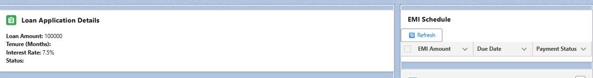

#  Phase 6: User Interface Development  

---

##  Introduction
Phase 6 focused on the **UI/UX layer** of CLMS using Salesforce **Lightning Experience**.  
The objective was to create user-friendly, modular, and dynamic interfaces so that Loan Officers, Credit Managers, and Branch Managers can easily interact with loan applications, EMIs, approvals, and related records.  

---

### 🔹 Lightning App Builder
- Built custom pages (App Page, Record Page, Home Page).  
- **In CLMS:**  
  - Loan Application Record Page → shows Loan details + EMI Schedule.  
  - CLMS Home Page → shows recent items, loan reports, pending approvals.  
- **Outcome:** Flexible layouts for different roles.

---

### 🔹 Record Pages
- Custom record pages created for:  
  - Loan Application (loan details + EMI Viewer LWC).  
  - EMI Schedule (EMI details + related Loan).  
  - Loan Document (document details + loan reference).  
  - Approval History (role, decision, comments).  
- **Outcome:** Each record has its own optimized Lightning layout.

  
   

---

### 🔹 Tabs
- Added CLMS navigation tabs:  
  - Loan Application, EMI Schedule, Payment, Loan Document, Approval History.  
- **Outcome:** Quick switching between CLMS objects.  

 

---

### 🔹 Home Page Layouts
- Created **CLMS Home Page** via App Builder.  
- Components added:  
  - Recent Items → quick access to loans.  
  - Report Chart → Loans Approved This Month.  
  - List View → Pending approvals.  
- **Outcome:** Centralized dashboard.  

 

---

### 🔹 Utility Bar
- Added Utility Bar in CLMS App.  
- Items: Notes, Recent Items.  
- **Outcome:** Quick actions available across the app.  

 

---

### 🔹 Lightning Web Components (LWCs)
Developed LWCs for CLMS:  
1. `loanApplicationViewer` → displays loan details.  
2. `emiScheduleViewer` → lists EMI records + refresh option.  

 

---

### 🔹 Apex with LWC
- Added Apex methods in **LoanHelper.cls**:  
  - `calculateEMI()` → EMI logic.  
  - `getEmiByLoan()` → fetch EMI schedules.  
- **Used in LWC:** `emiScheduleViewer` uses @wire + imperative calls.  

---

### 🔹 Events in LWC
- Added event handling in LWCs:  
  - Example: Refresh button triggers EMI list reload.  
- **Outcome:** LWCs became interactive and dynamic.  

---

### 🔹 Wire Adapters
- Used `@wire` with `getEmiByLoan`.  
- Auto-updates EMI list when Loan Application changes.  

---

### 🔹 Imperative Apex Calls
- Refresh button → calls Apex imperatively → reloads EMI list.
- LOAN APPLICATION VIEWER

- EMISCHEDULER VIEWER

---

### 🔹 Navigation Service
- Added record navigation inside LWCs.  
- Example: From EMI Schedule → back to Loan Application.  

---

## 3. Outcomes
- Built **modular Lightning Pages** for CLMS.  
- Created **custom LWCs** integrated with Apex.  
- Enhanced usability with **Home Page + Utility Bar**.  
- Added **auto-refresh (wire)** and **manual refresh (imperative Apex)**.  
- Implemented **navigation & events** for smooth user experience.  

---

## 4. Conclusion
Phase 6 delivered a **modern Lightning Experience UI** for CLMS.  
Users can now work with loans, EMIs, and approvals in a **single consolidated workspace**.  
With LWCs and Apex integration, the UI is **interactive, scalable, and user-friendly**.  

---
