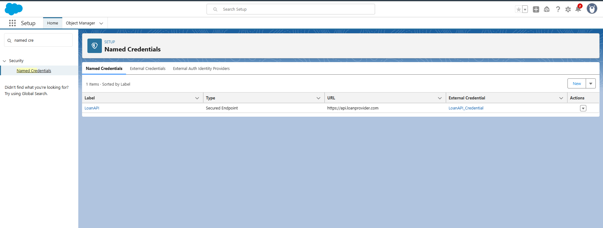
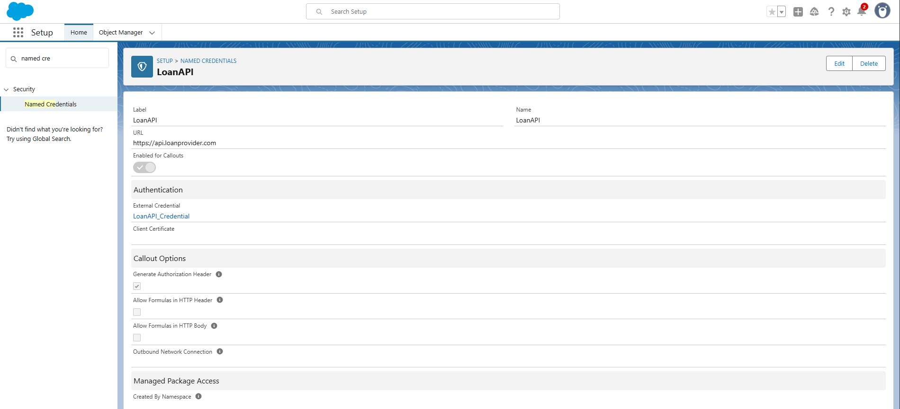
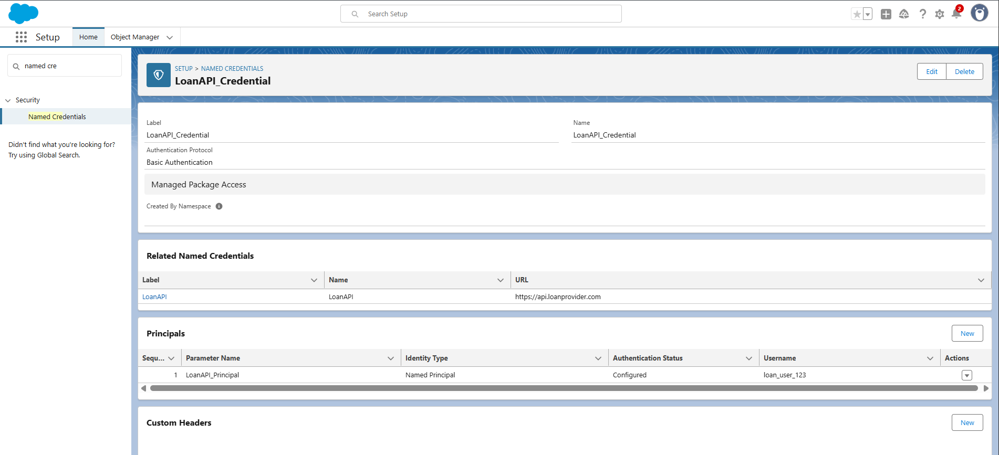
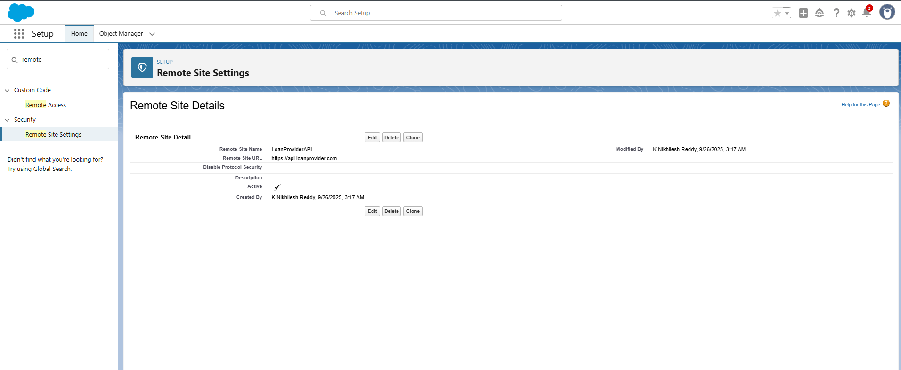
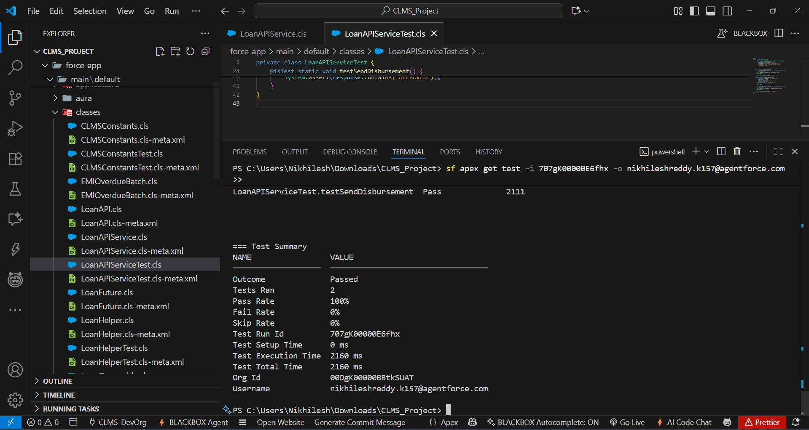
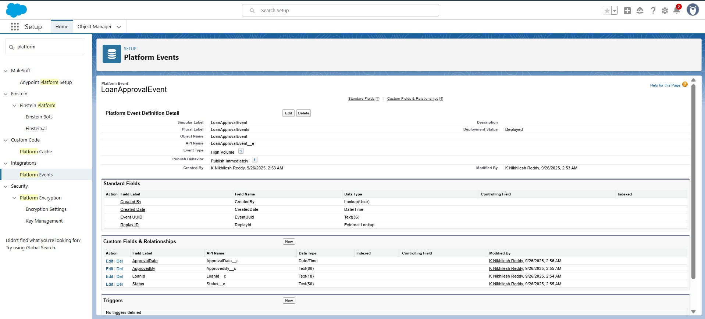
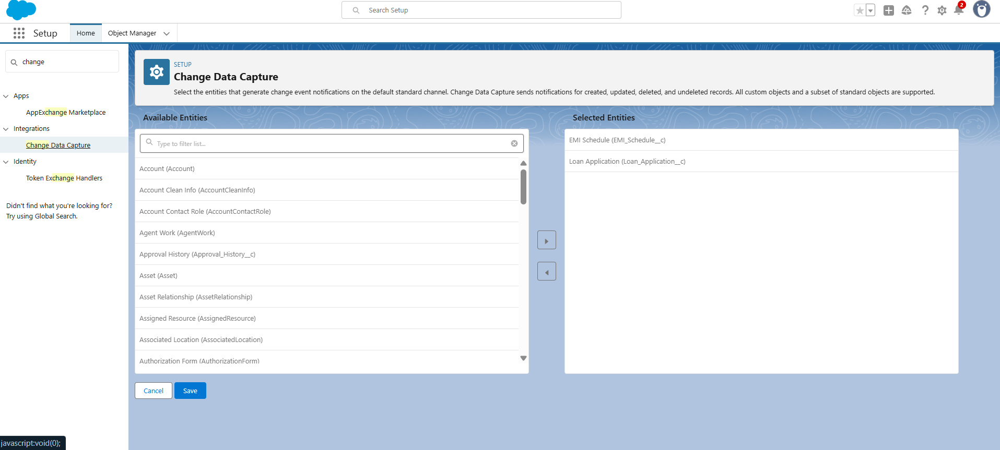

#  Phase 7: Integration & External Access  

In this phase, integration capabilities were enabled for the **Corporate Loan Management System (CLMS)** to securely communicate with external systems (Loan Provider APIs, reporting systems, and real-time subscribers). Salesforce features such as **Named Credentials, Callouts, Platform Events, Change Data Capture, and OAuth authentication** were configured to ensure secure, scalable, and real-time access.  

---

## 🔹 Named Credentials  

**Purpose**: Store external API endpoints and authentication securely, avoiding hardcoding credentials in Apex.  

**Configuration**:  
- **Label**: LoanAPI  
- **URL**: `https://api.loanprovider.com`  
- **External Credential**: LoanAPI_Credential (with username/password principal).  
- **Enabled for Callouts**: ✅  

 **Outcome**: Allows CLMS to securely call external Loan Provider APIs for loan validation and processing.  

---

## 🔹 External Services & Remote Site Settings  

- **External Services**: Configured to connect Salesforce with REST endpoints using schema (if available).  
- **Remote Site Settings**: Added `https://api.loanprovider.com` for API access.  

 **Outcome**: Ensures Salesforce can make outbound callouts to the loan provider system.  

---

## 🔹 Apex REST Callouts  

**Class**: `LoanAPIService.cls`  
- Apex class created to fetch loan data from external APIs using the Named Credential.  

 **Outcome**: CLMS can fetch or validate loan details from external APIs in real-time.  

 

---

## 🔹 Platform Events  

- **Event Created**: `LoanApprovalEvent__e`  
- **Fields**: `LoanId__c`, `Status__c`, `ApprovedBy__c`, `ApprovalDate__c`  
- **Trigger Update**: Publishes event when a loan is approved.  

 **Outcome**: External systems (e.g., MuleSoft, CometD subscribers) receive real-time notifications when loans are approved.  

---

## 🔹 Change Data Capture (CDC)  

**Enabled for**:  
- Loan Application (`Loan_Application__c`)  
- EMI Schedule (`EMI_Schedule__c`)  

 **Outcome**: External systems can subscribe to Salesforce data changes (insert/update/delete), ensuring data synchronization.  

 

---

## 🔹 Salesforce Connect  

- **Purpose**: For accessing external databases without storing data in Salesforce.  
- **Note**: Not implemented yet, but available for future CLMS scaling.  

---

## 🔹 API Limits  

- **Monitored in**: Setup → System Overview → API Usage.  
- **Ensured**: Integration designs respect Salesforce daily limits.  

  

---

## 🔹 OAuth & Authentication  

- **Connected App Created** for CLMS external API access.  
- **Configured**:  
  - OAuth Scopes: `api`, `refresh_token`  
  - Callback URL: External system endpoint  

 **Outcome**: External systems can authenticate securely and call Salesforce APIs.  

  

---

#  Phase 7 Outcomes  

- CLMS now supports secure external integration with Loan Provider APIs.  
- Loan approvals trigger **real-time notifications** via Platform Events.  
- Data synchronization possible with **Change Data Capture (CDC)**.  
- **OAuth** ensures external access is secure and authenticated.  
- Integration design respects **Salesforce API limits** for scalability.  

---

