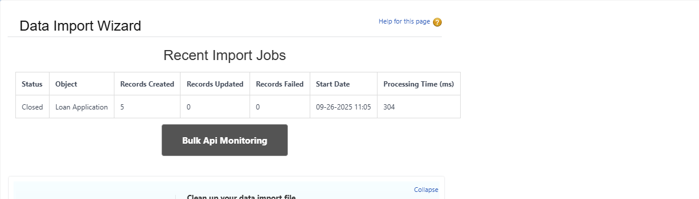
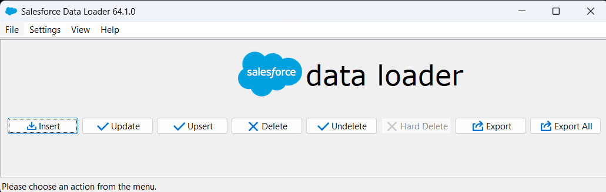
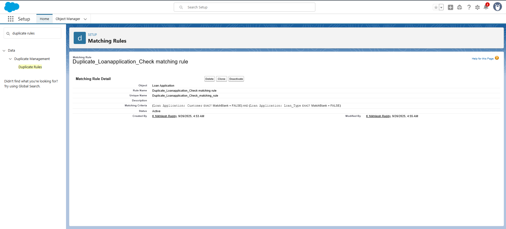
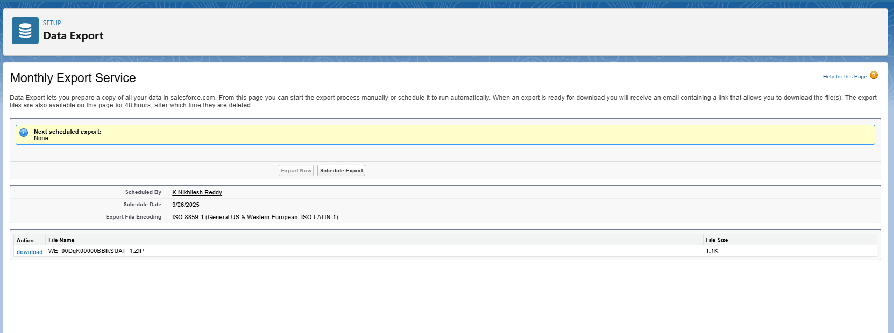
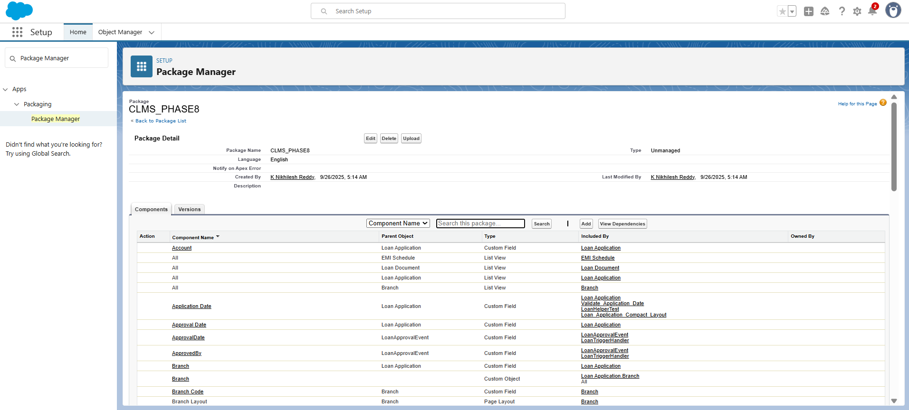
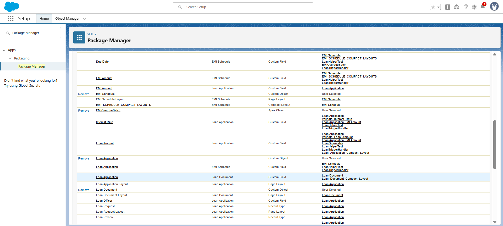
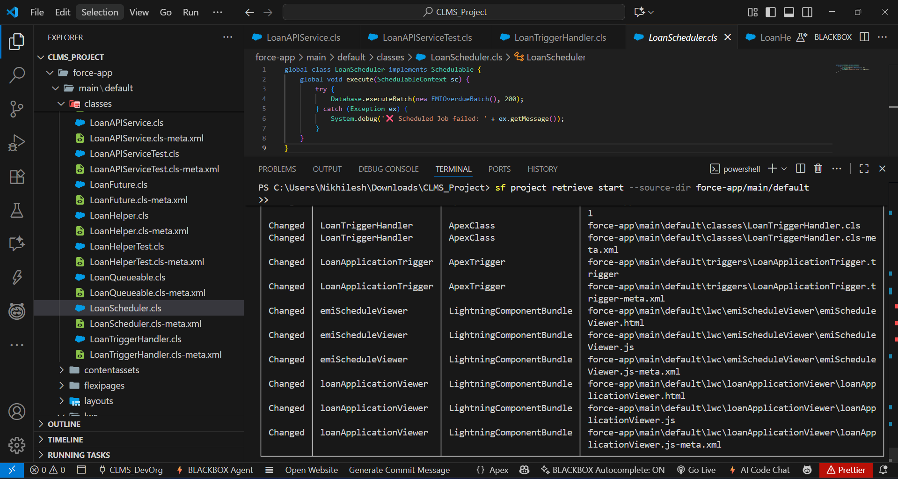

#  Phase 8: Data Management & Deployment (CLMS Project)

In this phase, **data management and deployment practices** were implemented in the **Corporate Loan Management System (CLMS)**.  
The focus was on **importing and exporting data**, preventing duplicates, ensuring secure backups, and deploying metadata from development → production using Salesforce-native tools.

---

## 🔹 1. Data Import Wizard
- **What I did**:
  - Used **Data Import Wizard** in Salesforce Setup.
  - Imported **Customer__c** and **Loan_Application__c** records from CSV files.
  - Mapped fields such as `Loan_Amount__c`, `Loan_Tenure_Months__c`, and `Interest_Rate__c`.
- **Why**:
  - To bulk load customer master data and initial loan applications into the system.
- **Screenshot to include**:
  - Data Import Wizard page showing field mapping.



---

## 🔹 2. Data Loader
- **What I did**:
  - Installed and logged in with Salesforce **username + password + security token**.
  - Performed **insert** and **update** operations on `EMI_Schedule__c` and `Loan_Application__c`.
  - Used **export** feature to back up EMI schedules for validation.
- **Why**:
  - To handle bulk data operations not possible through Import Wizard.


---

## 🔹 3. Duplicate Rules
- **What I did**:
  - Created a **Duplicate Rule** for `LoanApplication__c`.
  - Matching Criteria → **Customer** and **Loan Type**.
  - Action → **Block** duplicate creation.
- **Why**:
  - To ensure no customer is added twice with the same contact details.


---

## 🔹 4. Data Export & Backup
- **What I did**:
  - Scheduled **weekly data exports** in Salesforce Setup.
  - Selected objects: `Loan_Application__c`, `Customer__c`, `EMI_Schedule__c`.
  - Configured export to email ZIP backups.
- **Why**:
  - To maintain secure backups of all loan and customer data.

---

## 🔹 5. Change Sets
- **What I did**:
  - Created an **Outbound Change Set** in Sandbox.
  - Added metadata: LoanApplicationTrigger, LoanHelper class, EMIOverdueBatch, LWC components.
  - Uploaded and deployed the Change Set to target org.
- **Why**:
  - To move tested metadata from development to production.


---

## 🔹 6. Packages
- **What I did**:
  - Explored **Unmanaged Packages**.
  - Created a package for CLMS metadata to simplify deployments.
- **Why**:
  - To bundle components together for sharing and deployment.



---

## 🔹 7. VS Code & SFDX (Modern Deployment)
- **What I did**:
  - Used **VS Code + Salesforce CLI (SF)** for deployments.
  - Commands executed:
    ```bash
    # Deploy a single class
    sf project deploy start --source-dir force-app/main/default/classes/LoanHelper.cls

    # Deploy a trigger
    sf project deploy start --source-dir force-app/main/default/triggers/LoanApplicationTrigger.trigger

    # Deploy all metadata
    sf project deploy start --source-dir force-app/main/default
    ```
- **Why**:
  - This is the most modern and recommended approach for Salesforce deployments.


---

## ✅ Phase 8 Outcomes
- Customer and Loan data successfully imported into Salesforce.
- Bulk EMI records managed via **Data Loader**.
- Duplicate prevention established for Customer records.
- Weekly data export/backup configured for Loan, EMI, and Customer data.
- Metadata deployments done via **Change Sets** and **VS Code/SFDX**.
- Packages explored for bundling CLMS components.
- CLMS system is now **data-ready, secure, and production-deployable**.

---
