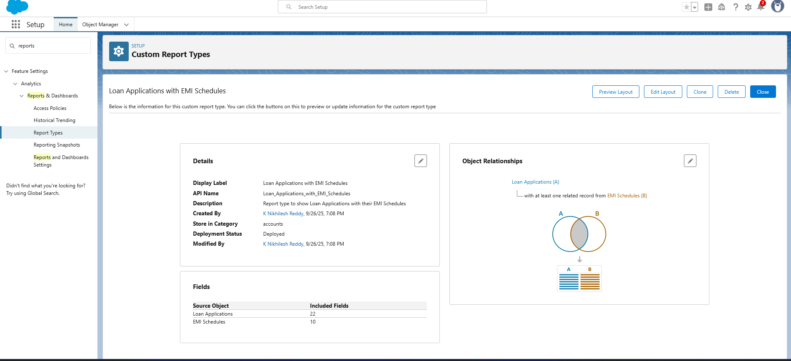
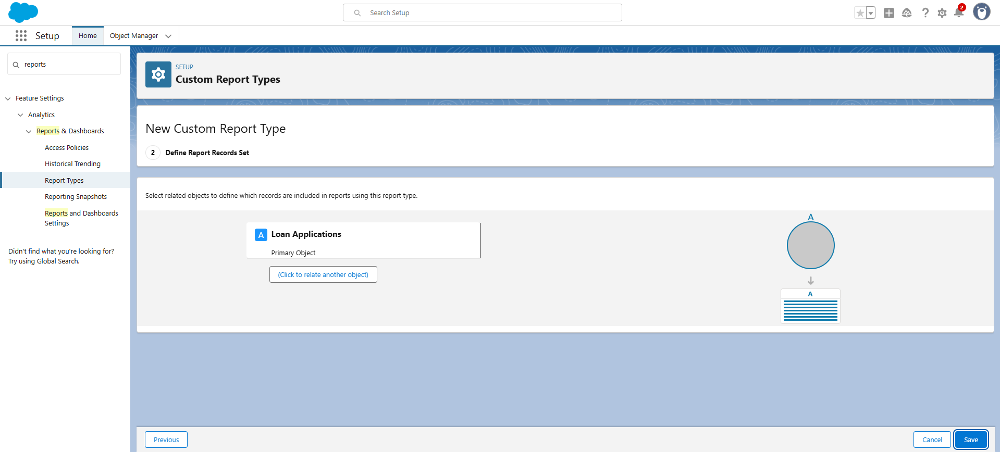
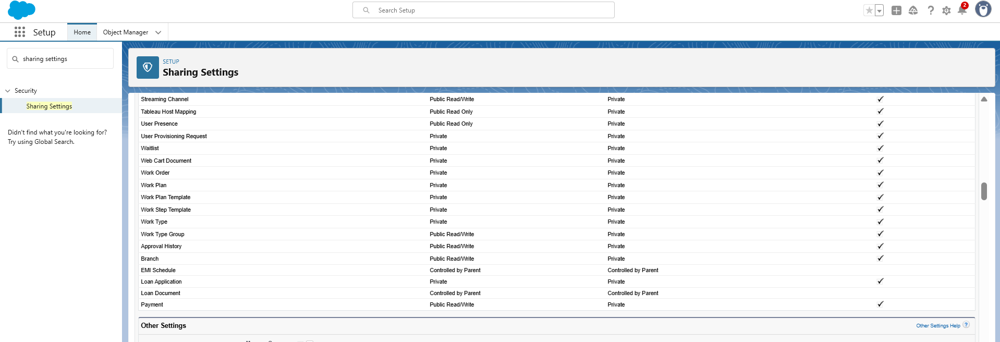

# Phase 9: Reporting, Dashboards & Security Review – CLMS Project

This phase focuses on **building reports, dashboards, and implementing security controls** in the Customer Loan Management System (CLMS).

---

## 📊 Reports
We used 4 types of reports in Salesforce:

1. **Tabular Report** – Simple list of loan applications.  
   - Example: All active loans with Customer Name, Loan Amount, Status.  

2. **Summary Report** – Grouped and summarized report.  
   - Example: Total loan amount grouped by Branch.  

3. **Matrix Report** – Comparison of two dimensions.  
   - Example: Loan Type vs Loan Approval Status.  

4. **Joined Report** – Combined data from multiple objects.  
   - Example: Customer + Loan Application + Repayment in one report.  

---

## 📑 Report Types

- **Custom Report Type**: Loan Applications (Primary) + Emi schedules (Related).  

---

## 📈 Dashboards
We built dashboards using the above reports:  
- Loan Status Pie Chart.  
- Branch-wise Loan Volume Bar Chart.  
- Repayment Trend Line Chart.  
- Top Customers by Loan Amount Table.
   

---

## 🔐 Security Review

### Sharing Settings
- Customer__c: Private.  
- Loan_Application__c: Controlled by Parent.  
- Repayment__c: Private.  
- Role Hierarchy: Admin → Branch Manager → Loan Officer.  
- Sharing Rules for Risk Team to view all loans.  

  
### Field Level Security (FLS)
- Sensitive fields (Credit Score, Salary) restricted to relevant profiles.  

### Session Settings
- Session timeout: 20 mins inactivity.  
- Browser security settings enabled.  
- Concurrent login restrictions applied.  

### Login IP Ranges
- Branch-specific IP ranges for Loan Officers.  
- Extended IP range for Admin users.  

### Audit Trail
- Setup Audit Trail enabled.  
- Logs downloaded for compliance (last 6 months of admin actions).  

---

## ✅ Deliverables
- Reports (Tabular, Summary, Matrix, Joined).  
- Custom Report Types.  
- Dashboards with KPIs.  
- Dynamic Dashboards for role-based visibility.  
- Security settings (Sharing, FLS, Session, IP, Audit Trail).  

---

