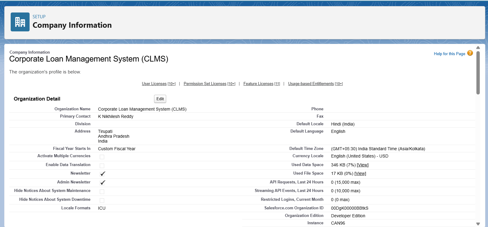
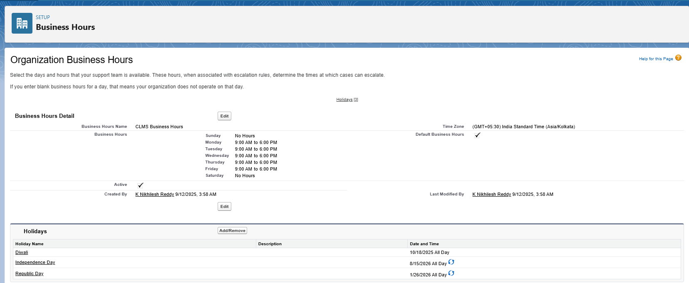
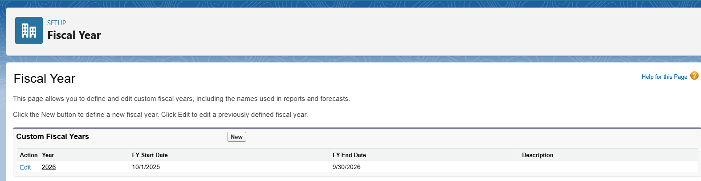
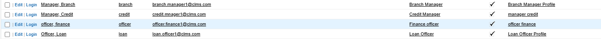
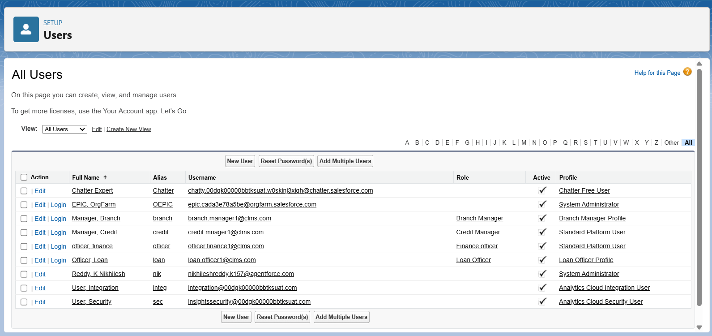
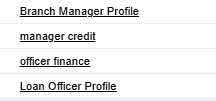
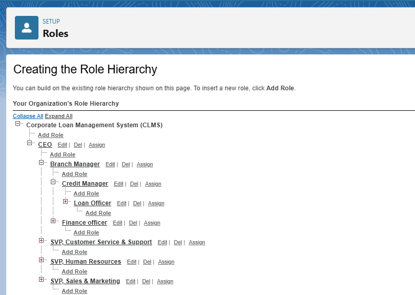

# CLMS Project – Phase 2: Org Setup & Configuration

This document outlines the organizational setup and configuration for the *Corporate Loan Management System (CLMS)* implemented on Salesforce Developer Edition.

---

## 1. Salesforce Editions
The CLMS project was developed using *Salesforce Developer Edition*, selected because it provides:

- Free access to the Salesforce platform for learning and development.
- Standard objects such as Accounts, Contacts, and Reports.
- Ability to create custom objects like *Loan Application* and *Loan Documents*.
- Full access to *profiles, roles, permission sets, OWD, and sharing rules*.
- App development and automation features (flows, workflows, validation rules).

This makes Developer Edition ideal for building an end-to-end corporate loan management solution.

---

## 2. Company Profile Setup
The company profile defines organizational details in Salesforce:

- **Organization Name:** Corporate Loan Management System (CLMS)  
- **Primary Contact:** K Nikhilesh Reddy  
- **Address:** Tirupati, Andhra Pradesh, India  
- **Default Locale:** Hindi (India)  
- **Default Language:** English  
- **Default Time Zone:** (GMT+05:30) India Standard Time (Asia/Kolkata)  
- **Currency Locale:** English (United States) - USD  
- **Organization Edition:** Developer Edition 

This configuration aligns Salesforce with Indian financial and working standards.

---

## 3. Business Hours & Holidays
Business hours ensure loan-related activities occur within official times:

**Business Hours:**  
- Monday – Friday: 9:00 AM to 6:00 PM  
- Saturday – Sunday: No Hours  

**Holidays Configured:**  
- Diwali → 10/18/2025  
- Independence Day → 08/15/2026  
- Republic Day → 01/26/2026  

  

This prevents scheduling on non-working days and ensures accurate turnaround times.

---

## 4. Fiscal Year Settings
The CLMS project uses a *custom fiscal year*:

- **Fiscal Year Type:** Custom Fiscal Year  
- **FY 2026 Start Date:** 10/01/2025  
- **FY 2026 End Date:** 09/30/2026   

Supports accurate financial planning, loan disbursement cycles, and EMI tracking.

---

## 5. User Setup & Licenses
Users represent stakeholders in corporate loan processing:

| User            | Role in CLMS                                         |
|-----------------|-----------------------------------------------------|
| Loan Officer    | Creates and submits loan requests                   |
| Credit Manager  | Reviews loan applications and decides approval     |
| Finance Officer | Verifies approved loans and handles fund disbursement |
| Branch Manager  | Oversees activities of Loan Officers, Credit Managers, and Finance Officers |
| CEO             | Top-level oversight and access to all records      |

Each user was assigned a Salesforce License for standard platform access.

---

## 6. Profiles
Profiles define object-level and field-level permissions:

| User            | Profile          | Access Description                                     |
|-----------------|----------------|--------------------------------------------------------|
| Loan Officer    | Standard User   | Create and edit Loan Applications                     |
| Credit Manager  | Standard User   | Review and update Loan Applications                   |
| Finance Officer | Standard User   | Manage financial records, disburse loans, update payments |
| Branch Manager  | Standard User   | Full visibility of subordinate roles and loan activities |
| CEO             | System Admin    | Complete control over the system                      |

---

## 7. Roles
A role hierarchy reflects the organizational chain of command:

- *CEO:* Visibility into all records  
- *Branch Manager:* Manages Credit and Finance Officers  
- *Credit Manager:* Supervises Loan Officers and loan approvals  
- *Loan Officer:* Creates loan requests  
- *Finance Officer:* Handles fund release and financial reporting  

---

## 8. Permission Sets
A custom permission set *“Loan Document Access”* allows users to upload, view, and download loan-related files.

- Assigned to *Credit Manager, Finance Officer, and Branch Manager*  
- Ensures proper document handling while maintaining security  

---

## 9. Organization-Wide Defaults (OWD)
Defines baseline data access levels:

- *Loan Applications:* Private → Only the record owner and managers can access  
- *Accounts and Contacts:* Public Read-Only → Basic customer details visible to all  
- *Loan Documents:* Controlled by Parent → Access follows related Loan Application  

Guarantees confidentiality of customer and loan data.

---

## 10. Sharing Rules
Extend access beyond OWD:

- *Loan Applications:* Shared with Credit Manager and Finance Officer roles for processing and disbursing loans  
- *Branch Manager:* Visibility to all records under their branch  

Ensures collaboration while maintaining security.

---

## 11. Login Access Policies
Configured to improve support and security:

- Enabled *Admin Login Access* for troubleshooting  
- Configured *IP restrictions* to limit unauthorized logins  

---

## 12. Developer Org Setup
Implementation used a *Salesforce Developer Org*:

- Free, fully functional Salesforce environment  
- Support for custom objects, roles, workflows, and reports  
- Flexibility to test and configure features before deployment  

---

## 13. Sandbox Usage
- Developer Edition does *not support Sandboxes*  
- Testing performed directly in the Developer Org  
- Documented as a limitation but manageable due to academic scope  

---

## 14. Deployment Basics
A custom Lightning App named *CLMS* has been created. This app centralizes access to the core business objects:

- *Loan Applications*  
- *Loan Documents*  
- *Accounts*  
- *Contacts*  
- *EMI Schedules*  
- *Users*  
- *Reports*  

This setup provides a single interface for all stakeholders to access, manage, and track loan-related operations efficiently within Salesforce.

